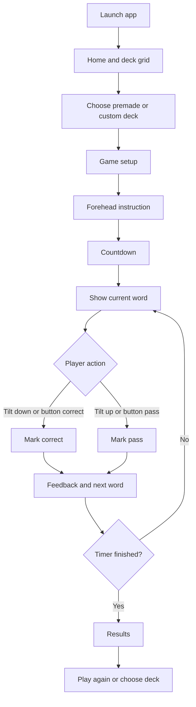
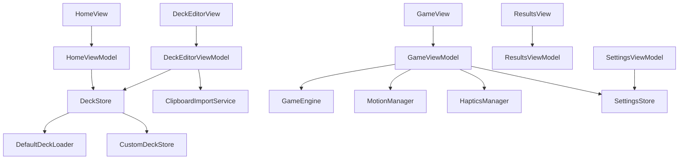
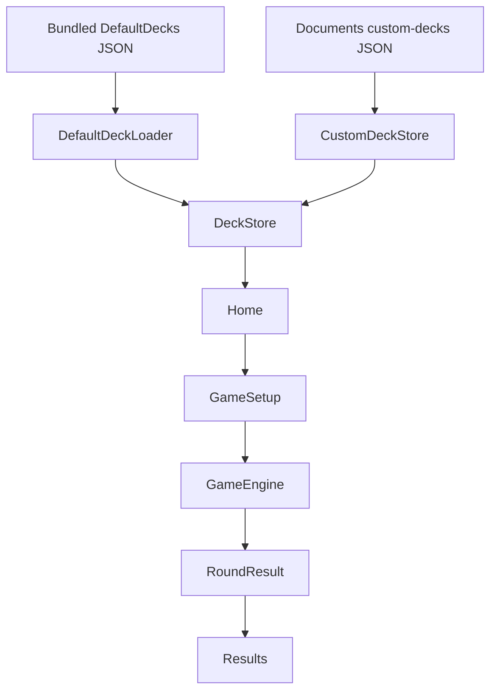
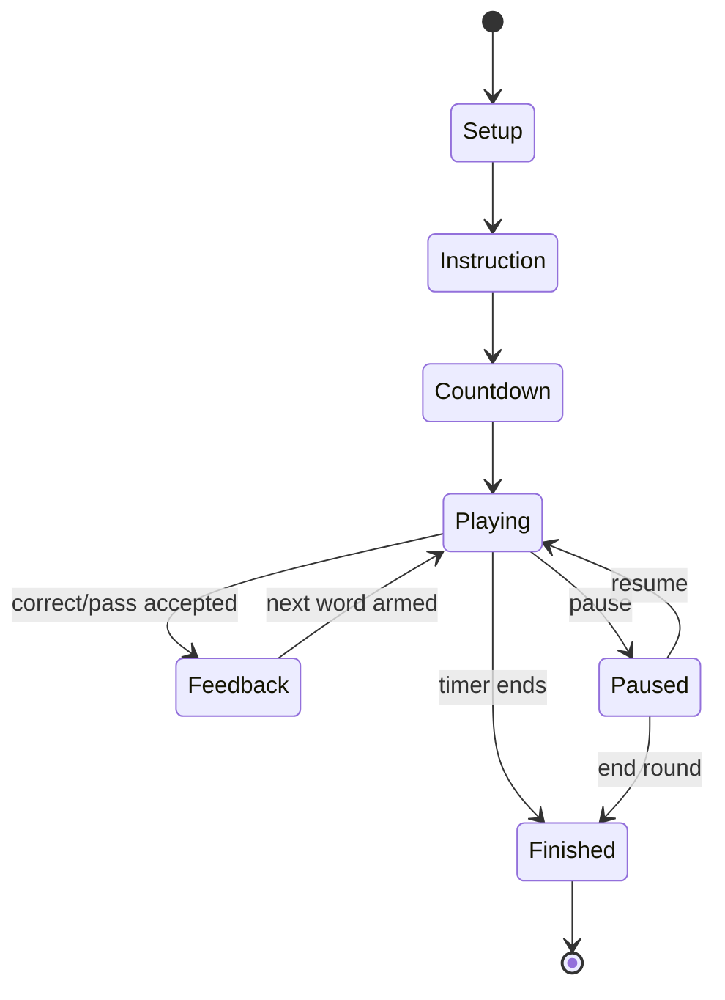

# feat: Build Charades: Tilt & Guess iPhone app

## Summary

Plan a native SwiftUI iPhone party game where players pick a word deck, hold the phone up, tilt down for correct, tilt up to pass, and review scored results after a timed round. The MVP uses bundled premade decks plus locally saved custom decks, keeps architecture beginner/intermediate-friendly, and borrows visual direction from the supplied screenshots without copying their product, layout, assets, or branding.

---

## Plan Section A: Product Summary

`Charades: Tilt & Guess` is a simple, polished iPhone party game for friends, families, classmates, and casual groups who want a fast "hold the phone on your forehead" guessing game without accounts, multiplayer setup, ads, or backend friction.

The core loop is:

1. Choose a premade or custom deck.
2. Pick a round duration.
3. Read the "Place the device on your forehead" instruction.
4. Start the countdown.
5. Show one large word at a time.
6. Tilt down to mark correct or tilt up to pass.
7. End when the timer reaches zero.
8. Review score, correct words, and passed words.

The MVP includes deck browsing, 3 to 5 premade decks, custom deck creation, manual card entry, newline-based clipboard import with review, local persistence, a timed game loop, score tracking, pause, results, haptics, and a playful dark visual style. It postpones multiplayer, accounts, cloud sync, ads, in-app purchases, sound effects, import/export files, deck sharing, and App Store marketing polish.

No multiplayer is included because the value of this app is immediate physical group play. A single phone already works as the shared game device, and removing network state keeps the MVP smaller, easier to test, and more reliable at parties.

The name `Charades: Tilt & Guess` clearly explains the product: it is a charades-style guessing game controlled by tilting the phone. Premade decks provide instant play. Custom decks let users make personal, AI-generated, classroom, fandom, or party-specific lists and use them exactly like built-in decks.

The reference screenshots influence the plan through broad visual principles: dark textured surfaces, colorful rounded deck cards, thick friendly typography, minimal landscape gameplay, rounded floating buttons, paste onboarding, large readable words, and satisfying feedback. The plan does not copy any exact icon, asset, screen composition, store page, copy, or branding.

---

## Requirements

### Product and Scope

- R1. The app must be a native iPhone app built with Swift and SwiftUI.
- R2. The MVP must be local-only: no backend, no login, no cloud database, no ads, no in-app purchases, and no multiplayer.
- R3. The app must feel like a polished party game, not a settings-style utility.
- R4. The implementation must be phase-by-phase and beginner/intermediate-friendly, with future coding phases stopping after each phase for summary, file list, test steps, tradeoffs, and approval.

### Decks

- R5. The app must show premade and custom decks in a colorful deck grid.
- R6. Premade decks must be bundled in the app, read-only in the MVP, and easy to edit during development.
- R7. Custom decks must support name, optional description, color, cards, local persistence, editing, and deletion.
- R8. Custom decks must only be playable when they contain enough valid cards.

### Custom Deck Creation

- R9. Users must be able to create a custom deck, choose a color, add cards manually, paste newline-separated words, review imported cards, edit/delete cards, cancel without saving, and save locally.
- R10. Manual card entry must validate non-empty text, show a character limit, disable add until valid, and avoid keyboard-broken layouts.
- R11. Clipboard import must trim whitespace, ignore blank lines, detect duplicates, handle very long lines, and preview parsed cards before import.

### Gameplay

- R12. A game round must show one large readable word at a time, track time, allow pause, track correct/pass words, and show results.
- R13. Tilt down must mark correct and tilt up must mark pass, with Core Motion detection, cooldown/debounce, thresholding, and accidental-trigger prevention.
- R14. The game must support a button-driven correct/pass prototype before motion detection is connected, so the game engine can be tested in simulator.
- R15. Gameplay should support landscape if practical, because it improves readability and matches the intended forehead-play posture.

### Results and Settings

- R16. Results must show final score, correct count, passed count, total attempted, correct words, passed words, play again, choose another deck, and home actions.
- R17. MVP settings should stay small: default duration, haptics on/off, and tilt sensitivity if it does not add too much complexity.

---

## Plan Section B: Feature Breakdown

### Home / Deck Grid

The home screen is the main hub: app name, settings button, optional playful deck illustration, colorful deck grid, plus button for custom deck creation, and a random/shuffle deck button if it does not distract.

### Deck Selection

Deck cards show name, color, card count, and optionally a small default/custom marker. Tapping a deck opens setup or deck detail depending on the final navigation choice.

### Premade Decks

Bundled read-only decks are available immediately. MVP should ship 3 to 5 categories, then expand after the game loop feels good.

### Custom Deck Creation

Users name a deck, choose a color, optionally add a description, then add cards manually or through paste import. Creation should feel like making a fun list, not managing a database.

### Custom Deck Management

Custom decks can be renamed, recolored, edited, and deleted. Premade decks are not directly editable; future versions can add "Duplicate as Custom Deck."

### Manual Card Creation

An `Add Card` sheet lets users enter one card, see `0 / 50`, add valid text, and quickly add another.

### Clipboard-Based Word Import

Users paste a newline-separated list, preview parsed cards, edit or delete entries, then import them into the current custom deck.

### Game Setup

The setup screen shows selected deck, word count, duration options, control explanation, and start action.

### Gameplay

The game screen is deliberately sparse: timer, pause, large word, optional score, and clear correct/pass feedback. Motion detection is connected after the button-based engine is tested.

### Pause Screen

Pause freezes timer and motion handling, then offers resume, restart round, end round, and exit to decks.

### Motion Detection

Core Motion reads device motion/attitude. The app converts pitch/roll changes into correct/pass actions with thresholds and cooldown.

### Scoring

Correct words increase score. Passed words are tracked separately. Words should not repeat in the same round until the deck is exhausted.

### Results

Results should feel satisfying: score first, stats second, word lists clearly separated, and clear replay/navigation actions.

### Settings

MVP settings are intentionally minimal. Future settings can add sound, tutorial behavior, theme, strict/relaxed tilt mode, and import/export preferences.

### Future Improvements

Future versions can add file import/export, deck duplication, tags, search, cloud sync, deck sharing, sound effects, richer animations, onboarding, and App Store screenshot polish.

---

## Plan Section C: Recommended MVP

The requested MVP is reasonable, but it should be delivered in smaller testable phases. The smallest useful MVP should include:

- Home / deck grid with `Charades: Tilt & Guess`.
- Dark playful visual style with colorful deck cards.
- 3 to 5 premade decks.
- Custom deck creation with name, color, manual cards, paste import, review, and local save.
- Game setup with fixed 60-second round first, then duration choices.
- Forehead instruction and countdown.
- Game screen with one word, timer, pause, score, and button-based correct/pass controls first.
- Results screen with correct/passed lists.
- Core Motion tilt detection connected after the button-based game engine works.
- Haptic feedback for correct/pass.
- Local data only.

If that still feels too large for a first prototype, build a smaller vertical slice first:

1. One premade deck.
2. Fixed 60-second round.
3. Button-based correct/pass.
4. Results screen.
5. No custom decks yet.

That prototype proves the game engine, timer, shuffle, scoring, pause, and results flow before adding persistence, clipboard parsing, and motion. After that, add custom decks and then Core Motion. This order is safer because motion can be hard to test in simulator, while the game rules can be made reliable without sensors.

---

## Plan Section D: Technical Architecture

### Xcode Project Type

Use a new iOS App project in Xcode with:

- Interface: SwiftUI.
- Language: Swift.
- Minimum iOS target: iOS 17 if the development machine and test phone support it. Use iOS 16 only if the user's physical test device requires it.
- Orientation support: portrait for setup/editor screens, landscape for gameplay if practical.
- Tests: include unit test target from the start. UI tests can be added once navigation stabilizes.

iOS 17 is a good modern target for a new SwiftUI app because it keeps NavigationStack-era APIs available and avoids older SwiftUI compatibility work. The plan does not require SwiftData, so iOS 17 is recommended for modern SwiftUI ergonomics rather than persistence.

### SwiftUI Structure

Keep the structure simple:

- Views own layout and lightweight interaction.
- ViewModels own screen state and validation.
- Services own persistence, clipboard parsing, motion, haptics, and settings.
- Models stay plain and Codable where possible.
- `GameEngine` owns round state and scoring, independent of Core Motion.

### Models Needed

- `Deck`
- `DeckType`
- `GameWord`
- `DeckColor`
- `GameSession`
- `GameState`
- `RoundResult`
- `GameSettings`
- `WordStatus`
- `ImportPreview`
- `ImportIssue`

### ViewModels Needed

- `HomeViewModel`
- `DeckEditorViewModel`
- `PasteImportViewModel`
- `GameSetupViewModel`
- `GameViewModel`
- `ResultsViewModel`
- `SettingsViewModel`

### Services Needed

- `DeckStore`
- `DefaultDeckLoader`
- `CustomDeckStore`
- `ClipboardImportService`
- `GameEngine`
- `MotionManager`
- `HapticsManager`
- `SettingsStore`
- `SoundManager` later, not MVP.

### Data Storage Approach

Use bundled JSON for default decks and a JSON file in the app documents directory for custom decks.

Recommended:

- Default decks: `Resources/DefaultDecks.json`.
- Custom decks: `custom-decks.json` in app documents directory.
- Settings: `UserDefaults` through `SettingsStore`.

Avoid SwiftData/CoreData for MVP. SwiftData is useful for richer persistence, relationships, queries, and future database-like features, but custom decks are a small Codable document. JSON files are easier for a beginner/intermediate developer to inspect, debug, back up, and reason about. CoreData is not justified for this MVP.

### Clipboard Import Approach

For MVP, use a text box where the user manually pastes. This is simpler, user-controlled, and avoids surprising clipboard reads. A direct "Paste from Clipboard" button can be added inside the import screen if it uses iOS-approved paste affordances and still shows preview before import.

### Motion Detection Layer

Use Core Motion `CMMotionManager` with processed device motion. Apple describes `CMMotionManager` as the object for starting and managing motion services and notes that device-motion data includes attitude, rotation rates, gravity, and user acceleration. The app should create a single motion manager, check availability, start updates only during active gameplay, and stop updates when paused, ended, or backgrounded.

### Game State Management

`GameEngine` should be platform-agnostic. It receives explicit actions:

- Start round.
- Mark current word correct.
- Mark current word passed.
- Tick timer.
- Pause.
- Resume.
- End round.

`MotionManager` only emits action intent: correct, pass, neutral, unavailable. It should not mutate score directly.

### Navigation Approach

Use a root `NavigationStack` for portrait setup flows:

- Home
- Deck detail/setup
- Deck editor
- Results
- Settings

Present game screens full-screen so gameplay can control orientation, pause behavior, and visual density without the normal navigation bar.

### Settings Approach

Use `GameSettings` as a Codable value persisted in `UserDefaults`. Keep MVP settings limited: default duration, haptics enabled, and tilt sensitivity after Core Motion proves stable.

### Testing Approach

Start with unit tests for parser, stores, models, and `GameEngine`. Simulator tests can cover deck management, game flow with buttons, timer logic, pause, and results. Real iPhone testing is required for Core Motion thresholds, haptics, orientation, and forehead-play ergonomics.

---

## Plan Section E: Folder Structure

```text
CharadesTiltGuess/
  App/
    CharadesTiltGuessApp.swift
    AppRouter.swift
  Models/
    Deck.swift
    DeckType.swift
    GameWord.swift
    DeckColor.swift
    GameSession.swift
    GameState.swift
    RoundResult.swift
    GameSettings.swift
    WordStatus.swift
    ImportPreview.swift
  Views/
    Home/
      HomeView.swift
      DeckGridView.swift
      DeckCardView.swift
    Decks/
      DeckDetailView.swift
      DeckSectionView.swift
    DeckEditor/
      DeckEditorView.swift
      DeckNameColorView.swift
      AddCardSheet.swift
      PasteImportView.swift
      ImportReviewView.swift
      CardListEditorView.swift
    Game/
      GameSetupView.swift
      ForeheadInstructionView.swift
      CountdownView.swift
      GameView.swift
      PauseOverlayView.swift
      TiltFeedbackView.swift
    Results/
      ResultsView.swift
      ResultWordListView.swift
    Settings/
      SettingsView.swift
  ViewModels/
    HomeViewModel.swift
    DeckEditorViewModel.swift
    PasteImportViewModel.swift
    GameSetupViewModel.swift
    GameViewModel.swift
    ResultsViewModel.swift
    SettingsViewModel.swift
  Services/
    DeckStore.swift
    CustomDeckStore.swift
    DefaultDeckLoader.swift
    GameEngine.swift
    SettingsStore.swift
    Motion/
      MotionManager.swift
      TiltAction.swift
      TiltSensitivity.swift
    Haptics/
      HapticsManager.swift
    Import/
      ClipboardImportService.swift
    Sound/
      SoundManager.swift
  Data/
    DefaultDecksSchema.md
  Resources/
    DefaultDecks.json
    Textures/
      BackgroundTexture.imageset
  Utilities/
    ValidationRules.swift
    AppTheme.swift
    DateProvider.swift
CharadesTiltGuessTests/
  GameEngineTests.swift
  ClipboardImportServiceTests.swift
  CustomDeckStoreTests.swift
  DefaultDeckLoaderTests.swift
  DeckEditorViewModelTests.swift
  SettingsStoreTests.swift
  MotionManagerTests.swift
CharadesTiltGuessUITests/
  DeckFlowUITests.swift
  GameFlowUITests.swift
```

Folder purpose:

- `App`: app entry point and top-level navigation.
- `Models`: Codable data structures and pure state.
- `Views`: SwiftUI screens and reusable UI pieces, grouped by feature.
- `ViewModels`: screen-level state, validation, and service coordination.
- `Services`: persistence, parsing, game engine, motion, haptics, settings, and future sound.
- `Data`: documentation for local formats and migrations.
- `Resources`: bundled JSON, textures, icons, and visual assets.
- `Utilities`: tiny shared helpers that are not feature-specific.
- Test targets: pure logic first, then UI flow tests after navigation stabilizes.

---

## Plan Section F: Data Model Design

### Deck

Fields:

- `id`: stable unique ID. Default decks can use readable IDs like `default-tech`; custom decks use generated IDs.
- `name`: user-facing title.
- `description`: optional short subtitle.
- `cards`: list of `GameWord`.
- `type`: default or custom.
- `color`: selected deck color token.
- `createdDate`: useful for custom deck sorting and future management.
- `updatedDate`: useful for custom deck editing and future sync/export.

Why: `Deck` is the central object that both home and gameplay understand. Keeping default and custom decks in one model lets the game use either without special casing.

### DeckType

Values:

- `default`
- `custom`

Why: Prevents editing premade decks directly and helps the UI show custom management actions only when allowed.

### GameWord

Fields:

- `id`: stable unique ID within a deck.
- `text`: visible word or phrase.

Why: A tiny model is enough for MVP. Future metadata like difficulty, hints, tags, or language can be added later.

### DeckColor

Fields:

- `id`: stable token such as `red`, `yellow`, `green`, `teal`, `blue`, `purple`, `pink`, `gray`.
- `displayName`: accessible label.
- `lightColor` and `darkColor` mapping in theme, not necessarily stored as raw color.

Why: Store color as a token rather than raw RGB so the theme can evolve without migrating user decks.

### GameSession

Fields:

- `id`: unique round ID.
- `deck`: deck snapshot used for the round.
- `duration`: round length in seconds.
- `remainingTime`: live countdown.
- `wordQueue`: shuffled words not yet attempted.
- `currentWord`: active word.
- `correctWords`: words marked correct.
- `passedWords`: words marked pass.
- `state`: setup, instruction, countdown, playing, paused, feedback, finished.

Why: Captures everything needed to run a single round and produce a result.

### GameState

Values:

- `idle`
- `setup`
- `instruction`
- `countdown`
- `playing`
- `paused`
- `feedback`
- `finished`

Why: Makes timer, pause, motion updates, and UI overlays explicit.

### RoundResult

Fields:

- `id`: result ID.
- `deckID`: source deck ID.
- `deckName`: source deck name at time of play.
- `duration`: round duration.
- `correctWords`: words marked correct.
- `passedWords`: words marked pass.
- `totalAttempted`: correct plus passed.
- `finalScore`: usually correct count.
- `completedAt`: timestamp.

Why: Results should not break if the deck is edited after the round.

### GameSettings

Fields:

- `defaultDuration`: 30, 60, 90, or 120 seconds.
- `hapticsEnabled`: boolean.
- `tiltSensitivity`: relaxed, normal, strict.
- `showInstructionBeforeRound`: boolean, optional for future.
- `soundEnabled`: future.
- `themeMode`: future system/dark option.

Why: Centralizes preferences and keeps settings lightweight.

### WordStatus

Values:

- `unseen`
- `current`
- `correct`
- `passed`

Why: Useful for results, UI feedback, and tests.

### ImportPreview

Fields:

- `validWords`: parsed words ready to import.
- `duplicates`: duplicate lines or deck duplicates.
- `tooLong`: words over the chosen limit.
- `emptyLineCount`: ignored blanks.
- `issues`: user-readable warnings.

Why: Keeps parsing deterministic and makes review screens easy to test.

---

## Plan Section G: Custom Deck Flow Design

Creation flow:

1. User opens the deck grid.
2. User taps the plus button.
3. `Create your own deck` sheet opens.
4. User enters deck name with a `0 / 20` style counter.
5. User chooses a deck color from circular swatches.
6. User optionally adds a short description.
7. Create button enables once the name is valid.
8. User taps Create.
9. Deck editor opens with an empty card list and clear actions: add one card, paste list, save, cancel.
10. Manual option opens `Add Card`, where the user types one card and taps Add.
11. Paste option opens import flow, where the user pastes multiple words separated by new lines.
12. App splits by new lines, trims spaces, ignores blank lines, detects duplicates, and flags long lines.
13. App shows parsed cards in a review list.
14. User edits or deletes imported cards if needed.
15. User saves the deck.
16. Deck appears in the deck grid.
17. User selects it and plays like a premade deck.

Editing flow:

- Rename deck from deck editor.
- Change deck color from the swatch row.
- Add cards manually.
- Paste more cards later.
- Edit card text inline or through a small edit sheet.
- Delete individual cards.
- Delete the entire custom deck with confirmation.

Rules:

- A custom deck must have a valid name and enough cards before it can start a round.
- Recommended MVP minimum: 5 cards.
- Recommended polished minimum: 10 cards.
- Premade decks are read-only. Later, add duplicate-as-custom instead of direct premade editing.

---

## Plan Section H: Clipboard Import Design

### Recommended MVP Flow

Use a dedicated paste/import screen with a large text area. The user manually pastes text, taps Preview, reviews the parsed cards, then imports. This is the simplest, most transparent MVP approach.

Direct clipboard reading can be added as a convenience button later or inside the import screen, but manual paste is better first because it avoids unexpected clipboard access and gives users a clear place to edit text before parsing.

### Parsing Rules

Input:

```text
Apple

Football

Shah Rukh Khan

Pizza

Spider-Man
```

Result:

- `Apple`
- `Football`
- `Shah Rukh Khan`
- `Pizza`
- `Spider-Man`

Rules:

- Split by new lines.
- Trim leading and trailing spaces.
- Ignore empty lines.
- Preserve internal spaces and punctuation.
- Normalize duplicate checks case-insensitively and trim-insensitively.
- Keep the user's visible spelling unless they edit it.
- Warn for duplicates rather than silently deleting in MVP.
- Warn and block import for very long lines over 50 characters, or ask the user to edit them in the review list.
- Cap a single paste import to a practical amount, such as 200 lines, to keep the UI responsive.

### Duplicate Handling

MVP recommendation: warn and preselect unique items, but keep duplicates visible in the review list so the user understands what happened. This is friendlier than silently removing words.

Duplicate types:

- Duplicate within pasted text.
- Duplicate already present in the deck.

### Error States

- Empty paste: "Paste one word or phrase per line."
- No valid cards after trimming: show the same guidance with an example.
- All duplicates: explain that the deck already has these cards.
- Too many lines: import the first allowed batch or ask the user to reduce the list.
- Long words: mark the row and require edit/delete before import.

### Preview UI

The preview should show:

- Total valid cards found.
- Ignored blank lines count if useful.
- Duplicate warnings.
- A list with edit/delete controls.
- Import button enabled only when at least one valid importable card remains.

---

## Plan Section I: Game Flow Design



Detailed flow:

1. Launch app.
2. Home shows deck grid and settings.
3. User chooses premade or custom deck.
4. App prevents start if the deck has too few words.
5. User chooses duration.
6. Instruction screen says `Place the device on your forehead`.
7. Countdown shows `3`, `2`, `1`, `Go`.
8. Game shows one word.
9. Tilt down marks correct, or button correct does so in prototype.
10. Tilt up marks pass, or button pass does so in prototype.
11. App shows brief feedback.
12. App advances to next word.
13. Round ends when timer reaches zero.
14. Results show score and word lists.
15. User can play again, choose another deck, or go home.

---

## Plan Section J: Motion Detection Design

### Framework

Use Core Motion through `CMMotionManager`. Prefer processed device motion over raw accelerometer-only data because device motion gives attitude and gravity-aligned information that is easier to reason about for tilt gestures.

### Tilt Direction

The user-stated mapping is:

- Tilt down = correct.
- Tilt up = pass.

In implementation, the exact axis depends on final gameplay orientation and device posture. Plan to prototype with a debug overlay on a real iPhone that displays pitch/roll values while the phone is held in forehead position.

### Thresholds

Use three zones:

- Neutral zone: ignore small movement.
- Correct zone: crosses down threshold.
- Pass zone: crosses up threshold.

Sensitivity setting can map to thresholds:

- Relaxed: lower threshold, easier to trigger.
- Normal: medium threshold.
- Strict: higher threshold, fewer accidental triggers.

### Cooldown and Debounce

After a correct/pass action:

- Stop accepting tilt actions for about 0.7 to 1.0 seconds.
- Show feedback.
- Advance word.
- Require return to neutral before accepting the next action.

This prevents one physical tilt from counting twice.

### Reset Neutral Position

At round start, capture a baseline attitude while the user is in the forehead position. After each action, wait for the phone to return close to baseline before arming the next word. If baseline proves too finicky, start with absolute thresholds and add calibration later.

### Accidental Movement Handling

- Ignore tiny movements.
- Ignore sensor updates while paused, in countdown, feedback, or results.
- Ignore triggers when timer is zero.
- Require the tilt direction to be sustained for a short duration or across several samples before counting.
- Use haptics only after the action is accepted.

### Simulator vs Real Device

Simulator can test:

- Game engine with button actions.
- Timer.
- Pause.
- Results.
- Navigation.
- Deck creation and import.

Real iPhone is required for:

- Motion data availability.
- Threshold tuning.
- Forehead posture.
- Landscape behavior.
- Haptics.
- Accidental double-trigger testing.

---

## Plan Section K: UI / UX Design

### Visual Direction

Use a dark, textured main background with playful contrast. The texture can be a subtle image asset or generated noise overlay. Keep it restrained so text remains readable.

Inspired elements:

- Large rounded deck cards.
- Bright colors against a dark surface.
- Soft shadows and lower-edge depth.
- Thick rounded typography.
- Floating circular or rounded icon buttons.
- Friendly modal cards for create/add/paste flows.
- Minimal landscape game surface.

Avoid:

- Copying exact icons, card illustrations, layouts, wording, or store identity.
- Overly plain Apple settings-style lists for the main experience.
- Heavy decoration that harms readability.

### Home / Deck Grid

- Top-right settings icon.
- App title as a first-viewport signal.
- Optional custom deck-card illustration built from simple original shapes or app-owned assets.
- `Decks` section title with plus button nearby.
- Two-column colorful deck grid.
- Random deck button as a small floating action, not a primary route.

### Custom Deck Creation

- Dark textured sheet or full-screen modal.
- Big title: `Create your own deck`.
- Large text field for deck name with character count.
- Color swatches as circular buttons with clear selected ring.
- Create button disabled until valid.
- Keyboard-safe layout using scrollable content and bottom-safe-area padding.

### Add Card Modal

- Big yellow or deck-colored card surface.
- Title: `Add Card`.
- Single text field.
- `0 / 50` counter.
- Add button disabled until non-empty valid text.
- X button to cancel.
- Option after add: close automatically or clear the field for fast repeated entry. MVP should clear and keep the sheet open with an explicit Done/Close.

### Paste / Import Onboarding

- Short, friendly copy: "Paste one word or phrase per line."
- Example mini-card with 3 lines.
- Big paste text area.
- Preview button.
- Review screen with valid rows, warnings, edit/delete, and import.

### Game Setup

- Selected deck card preview.
- Duration segmented control: 30, 60, 90, 120.
- Control explanation with large icons: down = correct, up = pass.
- Start button.
- Too-few-cards warning when needed.

### Forehead Instruction and Countdown

- Full-screen landscape-friendly card.
- Large text: `Place the device on your forehead`.
- Countdown: large centered number with subtle scale animation.

### Gameplay

- Landscape primary layout if practical.
- Big rounded dark game surface.
- Timer top center.
- Pause button top-left.
- Optional score small top-right or hidden until feedback.
- Word centered, extremely large, dynamic type aware, and minimum-scale controlled.
- Correct feedback: quick green full-screen/card flash.
- Pass feedback: quick red or warm neutral flash.

### Results

- Large score at top.
- Correct, passed, total attempted stats.
- Two separated lists: Correct and Passed.
- Play Again as primary action.
- Choose Deck and Home as secondary actions.

### Settings

- Keep MVP settings short and friendly.
- Use playful cards for groups rather than a generic long utility list.
- Include close button and app version later.

### Typography

Start with system fonts using rounded design where possible. If a custom font is added later, ensure licensing allows App Store use and keep a system fallback.

Suggested hierarchy:

- App title and deck card names: rounded heavy/bold.
- Game words: rounded black/heavy, very large.
- Body copy: rounded semibold or standard system for readability.

### Colors

Base:

- Deep blue-gray / charcoal background.
- White main text.
- Muted gray secondary text.

Deck colors:

- Green, yellow, blue, purple, pink, red, teal, gray.

Feedback:

- Correct: green.
- Pass: red or warm amber/red.

Accessibility:

- Do not rely on color alone. Use labels/icons and clear text.
- Respect Reduce Motion by simplifying animations.
- Support larger text in setup/editor/results, while gameplay word uses responsive fitting for distance readability.
- Ensure touch targets are at least comfortable iPhone sizes.

### Haptic Moments

- Light success haptic on correct.
- Light warning/selection haptic on pass.
- Soft impact on countdown Go.
- Optional haptic on save custom deck.

---

## Plan Section L: Default Deck Design

### MVP Decks

Start with 5 decks:

- Tech
- Movies
- Food
- Sports
- Famous People

These are broadly understandable, easy to test, and culturally flexible. If the first audience strongly prefers the screenshot-inspired categories, swap Movies for Bollywood or add Bollywood as the fifth deck.

### Later Decks

- Games
- Bollywood
- Fiction
- K Drama
- Cartoon
- Anime
- Wildlife
- Places
- Objects at Home
- School
- Music
- Brands

### Word Counts

- Prototype: 15 to 25 words per deck.
- MVP: 40 to 60 words per deck.
- Polished version: 100 to 300 words per deck, depending on category.

### Storage

Use `Resources/DefaultDecks.json`.

Benefits:

- Easier to edit without touching Swift files.
- Easy for future content expansion.
- Codable loader tests can validate schema.
- Keeps default content separate from app logic.

Custom decks remain separate in the documents-directory JSON file.

---

## Plan Section M: Settings Design

### MVP Settings

- Default round duration: 30, 60, 90, 120.
- Haptics on/off.
- Tilt sensitivity if Core Motion stabilizes early enough.

### Future Settings

- Sound effects on/off.
- Theme: dark, system, high contrast.
- Show tutorial before every round.
- Strict/relaxed tilt mode.
- Left-handed/right-handed mode only if real testing shows a need.
- Default behavior for custom deck import duplicates.
- Reset settings.

Keep settings out of the first prototype unless needed. The app should first prove the game loop.

---

## High-Level Technical Design

### Component Relationships



### Data Flow



### Gameplay State Machine



---

## Plan Section N: Phase-by-phase Roadmap

### Phase 0: Project Setup and Research

- **Goal:** Create the Xcode project and confirm target device, iOS version, orientation needs, and visual direction.
- **Features:** Empty SwiftUI app, test targets, app name, bundle naming, basic project settings.
- **Files likely created or modified:** `CharadesTiltGuess.xcodeproj`, `CharadesTiltGuess/App/CharadesTiltGuessApp.swift`, `CharadesTiltGuessTests/`, `CharadesTiltGuessUITests/`.
- **APIs / frameworks:** SwiftUI, XCTest.
- **Risks:** Wrong minimum iOS target or orientation settings can cause rework.
- **How to test:** Build and run blank app in simulator and real iPhone.
- **Definition of done:** App launches, tests target exists, real-device run path is known.

### Phase 1: App Skeleton and Navigation

- **Goal:** Add root app shell and navigation destinations without feature complexity.
- **Features:** Home placeholder, settings placeholder, deck setup placeholder, editor placeholder, game placeholder, results placeholder.
- **Files:** `App/AppRouter.swift`, `Views/Home/HomeView.swift`, `Views/Game/GameSetupView.swift`, `Views/Game/GameView.swift`, `Views/Results/ResultsView.swift`, `Views/Settings/SettingsView.swift`.
- **APIs / frameworks:** SwiftUI, NavigationStack, sheet/fullScreenCover.
- **Risks:** Overengineering navigation too early.
- **How to test:** Navigate through placeholders; dismiss modals cleanly.
- **Definition of done:** Every planned screen has a reachable placeholder route.

### Phase 2: Visual System and Reusable Components

- **Goal:** Establish playful UI primitives before building many screens.
- **Features:** App theme, colors, rounded deck card, icon button, primary button, background texture approach.
- **Files:** `Utilities/AppTheme.swift`, `Views/Home/DeckCardView.swift`, reusable component files as needed, `Resources/Textures/`.
- **APIs / frameworks:** SwiftUI shapes, materials, image assets.
- **Risks:** Spending too long polishing before game works.
- **How to test:** Component preview/screens render on small and large iPhones.
- **Definition of done:** App has consistent dark background, cards, buttons, typography, and spacing.

### Phase 3: Premade Deck Data and Deck Grid

- **Goal:** Load bundled decks and show them in the home grid.
- **Features:** `DefaultDecks.json`, loader, deck grid, deck card count, select deck.
- **Files:** `Resources/DefaultDecks.json`, `Models/Deck.swift`, `Models/GameWord.swift`, `Models/DeckType.swift`, `Services/DefaultDeckLoader.swift`, `Services/DeckStore.swift`, `ViewModels/HomeViewModel.swift`, `Views/Home/DeckGridView.swift`, `CharadesTiltGuessTests/DefaultDeckLoaderTests.swift`.
- **APIs / frameworks:** Codable, Bundle resource loading, XCTest.
- **Risks:** Invalid JSON or duplicated IDs.
- **How to test:** Unit test valid load, missing file failure, duplicate deck IDs, empty deck rejection.
- **Definition of done:** Home shows 3 to 5 premade decks from JSON.

### Phase 4: Custom Deck Data Model and Local Storage

- **Goal:** Persist custom decks locally.
- **Features:** Codable custom decks, documents-directory JSON storage, load/save/delete.
- **Files:** `Services/CustomDeckStore.swift`, `Models/DeckColor.swift`, `CharadesTiltGuessTests/CustomDeckStoreTests.swift`, `Data/DefaultDecksSchema.md`.
- **APIs / frameworks:** FileManager, Codable, XCTest.
- **Risks:** File corruption, migration needs later.
- **How to test:** Save, reload, update, delete, handle missing file, handle corrupt file gracefully.
- **Definition of done:** Custom decks persist after app restart.

### Phase 5: Custom Deck Creation Screen with Name and Color

- **Goal:** Create the first custom deck shell.
- **Features:** Create deck sheet, name field, optional description, color swatches, validation, cancel.
- **Files:** `Views/DeckEditor/DeckNameColorView.swift`, `Views/DeckEditor/DeckEditorView.swift`, `ViewModels/DeckEditorViewModel.swift`, `CharadesTiltGuessTests/DeckEditorViewModelTests.swift`.
- **APIs / frameworks:** SwiftUI forms/custom layouts, FocusState.
- **Risks:** Keyboard layout overlap.
- **How to test:** Empty name disabled, long name counter, color selection, cancel without saving.
- **Definition of done:** User can create a custom deck shell with valid name and color.

### Phase 6: Manual Card Entry

- **Goal:** Add one-card-at-a-time editing.
- **Features:** Add Card sheet, character limit, validation, add another quickly, delete/edit rows.
- **Files:** `Views/DeckEditor/AddCardSheet.swift`, `Views/DeckEditor/CardListEditorView.swift`, `ViewModels/DeckEditorViewModel.swift`, `CharadesTiltGuessTests/DeckEditorViewModelTests.swift`.
- **APIs / frameworks:** SwiftUI sheet, FocusState, validation helpers.
- **Risks:** Duplicated validation scattered across views.
- **How to test:** Add valid card, reject blank, reject too-long, edit card, delete card, keyboard safe.
- **Definition of done:** User can build a deck manually and save it.

### Phase 7: Clipboard Paste Import for Newline-separated Words

- **Goal:** Import many cards from pasted text with review.
- **Features:** Paste explanation, text area, parser, duplicate warnings, long-line warnings, review list, import.
- **Files:** `Services/Import/ClipboardImportService.swift`, `Models/ImportPreview.swift`, `Views/DeckEditor/PasteImportView.swift`, `Views/DeckEditor/ImportReviewView.swift`, `ViewModels/PasteImportViewModel.swift`, `CharadesTiltGuessTests/ClipboardImportServiceTests.swift`.
- **APIs / frameworks:** UIKit pasteboard if direct paste button is added, SwiftUI text editor, XCTest.
- **Risks:** Edge cases with blank lines, duplicated words, huge paste lists.
- **How to test:** Newline parsing, blank lines ignored, duplicate detection, long word warning, empty paste, 200+ line paste.
- **Definition of done:** User can paste an AI-generated list, review it, edit/delete rows, and import valid cards.

### Phase 8: Custom Deck Editing and Deletion

- **Goal:** Make custom decks manageable after creation.
- **Features:** Rename, recolor, edit cards, delete cards, delete deck, prevent premade editing.
- **Files:** `Views/Decks/DeckDetailView.swift`, `Views/DeckEditor/DeckEditorView.swift`, `Services/DeckStore.swift`, tests for store/view model.
- **APIs / frameworks:** SwiftUI confirmation dialogs, Codable persistence.
- **Risks:** Accidentally allowing premade deck edits.
- **How to test:** Edit custom deck, delete custom deck, verify premade edit controls hidden, persistence after restart.
- **Definition of done:** Custom decks can be maintained cleanly.

### Phase 9: Game Setup and Forehead Instruction Screen

- **Goal:** Prepare the user for a round.
- **Features:** Selected deck setup, duration selection, too-few-cards warning, controls explanation, instruction screen.
- **Files:** `Views/Game/GameSetupView.swift`, `Views/Game/ForeheadInstructionView.swift`, `ViewModels/GameSetupViewModel.swift`.
- **APIs / frameworks:** SwiftUI segmented controls/custom buttons.
- **Risks:** Too much text before play.
- **How to test:** Valid deck starts, too-small deck blocked, duration selection works.
- **Definition of done:** User can move from deck selection to instruction/countdown.

### Phase 10: Game State Engine Without Motion

- **Goal:** Build testable gameplay rules before sensors.
- **Features:** Shuffle deck, current word, button correct/pass, no repeats, end state.
- **Files:** `Services/GameEngine.swift`, `Models/GameSession.swift`, `Models/GameState.swift`, `Models/WordStatus.swift`, `CharadesTiltGuessTests/GameEngineTests.swift`.
- **APIs / frameworks:** Foundation, XCTest.
- **Risks:** Game rules coupled to UI.
- **How to test:** Start round, mark correct, mark pass, advance word, no repeat, deck exhaustion behavior.
- **Definition of done:** Game can be played using buttons in simulator.

### Phase 11: Timer, Pause, and Score Tracking

- **Goal:** Add timed round behavior and pause.
- **Features:** Countdown timer, pause/resume, restart, end round, score tracking.
- **Files:** `ViewModels/GameViewModel.swift`, `Services/GameEngine.swift`, `Views/Game/PauseOverlayView.swift`, `CharadesTiltGuessTests/GameEngineTests.swift`.
- **APIs / frameworks:** Swift concurrency timer or Combine timer, XCTest.
- **Risks:** Timer fires while paused/backgrounded.
- **How to test:** Timer reaches zero, pause freezes time, resume continues, end round creates result, timer-zero during action is safe.
- **Definition of done:** Timed button-based game is reliable.

### Phase 12: Results Screen

- **Goal:** Show final round outcome.
- **Features:** Score, correct count, passed count, total attempted, correct/passed lists, replay, choose deck, home.
- **Files:** `Models/RoundResult.swift`, `Views/Results/ResultsView.swift`, `Views/Results/ResultWordListView.swift`, `ViewModels/ResultsViewModel.swift`.
- **APIs / frameworks:** SwiftUI lists/scroll views.
- **Risks:** Results become cluttered with long word lists.
- **How to test:** Correct and passed words show in correct sections; replay uses same deck; choose deck returns home.
- **Definition of done:** A full no-motion game loop ends in useful results.

### Phase 13: CoreMotion Tilt Detection Prototype

- **Goal:** Prototype sensor readings on real iPhone.
- **Features:** MotionManager, tilt debug state, thresholds, availability handling.
- **Files:** `Services/Motion/MotionManager.swift`, `Services/Motion/TiltAction.swift`, `Services/Motion/TiltSensitivity.swift`, `CharadesTiltGuessTests/MotionManagerTests.swift`.
- **APIs / frameworks:** Core Motion.
- **Risks:** Simulator cannot validate real tilt. Forehead posture may invert expected axis.
- **How to test:** Real iPhone debug build, observe pitch/roll, verify down/up actions, pause stops updates.
- **Definition of done:** Real phone produces stable correct/pass intent events.

### Phase 14: Connect Tilt Detection to Gameplay

- **Goal:** Replace or supplement buttons with tilt actions.
- **Features:** Motion-to-engine action routing, cooldown, neutral reset, action gating by game state.
- **Files:** `ViewModels/GameViewModel.swift`, `Services/Motion/MotionManager.swift`, `Services/GameEngine.swift`, `Views/Game/GameView.swift`.
- **APIs / frameworks:** Core Motion, SwiftUI state updates.
- **Risks:** Double counting and accidental triggers.
- **How to test:** Tilt once counts once, cooldown works, pause disables motion, timer-zero action ignored.
- **Definition of done:** Real iPhone tilt gameplay works through a full round.

### Phase 15: Haptics and Feedback Animations

- **Goal:** Make actions feel responsive and satisfying.
- **Features:** Correct/pass haptics, feedback color flash, countdown animation.
- **Files:** `Services/Haptics/HapticsManager.swift`, `Views/Game/TiltFeedbackView.swift`, `Views/Game/CountdownView.swift`, `ViewModels/GameViewModel.swift`.
- **APIs / frameworks:** UIKit haptics or Core Haptics if needed later, SwiftUI animation.
- **Risks:** Overdone motion effects or haptics firing when disabled.
- **How to test:** Haptics toggle, correct/pass feedback timing, Reduce Motion behavior.
- **Definition of done:** Feedback is clear, quick, and not distracting.

### Phase 16: Settings

- **Goal:** Add minimal settings.
- **Features:** Default duration, haptics on/off, tilt sensitivity if ready.
- **Files:** `Models/GameSettings.swift`, `Services/SettingsStore.swift`, `Views/Settings/SettingsView.swift`, `ViewModels/SettingsViewModel.swift`, `CharadesTiltGuessTests/SettingsStoreTests.swift`.
- **APIs / frameworks:** UserDefaults, SwiftUI toggles/segmented controls.
- **Risks:** Settings added before behavior is stable.
- **How to test:** Persist settings, apply default duration, haptics toggle works.
- **Definition of done:** MVP settings are persisted and respected.

### Phase 17: UI Polish

- **Goal:** Make the app feel finished.
- **Features:** Texture refinement, spacing, card shadows, empty states, accessibility, landscape polish.
- **Files:** Views across `Views/`, `Utilities/AppTheme.swift`, resources.
- **APIs / frameworks:** SwiftUI layout, accessibility modifiers.
- **Risks:** Visual polish introduces layout bugs on small phones.
- **How to test:** iPhone SE, standard, Pro Max, portrait editor, landscape game, Dynamic Type, dark/light behavior.
- **Definition of done:** No obvious text overlap, broken keyboard layouts, or unreadable game words.

### Phase 18: Real iPhone Testing and Bug Fixing

- **Goal:** Validate party-game feel outside simulator.
- **Features:** Motion threshold tuning, haptic tuning, background handling, orientation handling.
- **Files:** Likely `MotionManager`, `GameViewModel`, `GameView`, settings/theme files.
- **APIs / frameworks:** Core Motion, scene lifecycle, orientation APIs.
- **Risks:** Tilt feels unreliable in real use.
- **How to test:** Multiple rounds on real iPhone, slow/aggressive tilt, background app, phone orientation changes.
- **Definition of done:** A real group can play several rounds without confusing controls or repeated miscounts.

### Phase 19: App Icon, Naming, Packaging, and Future App Store Readiness

- **Goal:** Prepare for a polished local build and future distribution.
- **Features:** Original app icon, launch screen polish, app display name, versioning, privacy notes, screenshots later.
- **Files:** `Assets.xcassets`, app settings, launch screen assets if used, docs.
- **APIs / frameworks:** Xcode asset catalog.
- **Risks:** Accidentally copying reference app icon or branding.
- **How to test:** Install on real iPhone, verify display name/icon, check no private API or required privacy omission.
- **Definition of done:** App looks named and packaged professionally for device testing.

---

## Plan Section O: Testing Plan

### Simulator Testing

- Premade deck loading.
- Deck grid display.
- Custom deck creation.
- Custom deck color selection.
- Custom deck rename.
- Custom deck delete.
- Manual card add.
- Manual card edit.
- Manual card delete.
- Clipboard paste import through text area.
- Newline parsing.
- Blank line handling.
- Duplicate handling.
- Very long word handling.
- Empty custom deck warnings.
- Local persistence after app restart.
- Button-based game loop.
- Timer.
- Pause.
- Score.
- Shuffle.
- Results.
- Settings persistence.
- UI on multiple iPhone simulators.

### Real iPhone Testing

- Motion sensor availability.
- Tilt down threshold.
- Tilt up threshold.
- Neutral reset.
- Slow tilt.
- Aggressive tilt.
- Accidental double trigger.
- Haptics.
- Landscape gameplay.
- Forehead readability.
- App backgrounding during round.
- Orientation changes during round.

### Edge Cases

- Deck has no words: cannot start; helpful message.
- Deck has very few words: cannot start until minimum met.
- User pastes empty clipboard text: parser shows guidance.
- User pastes many blank lines: blanks ignored.
- User pastes duplicate words: warning shown.
- User pastes very long lines: rows flagged for edit/delete.
- User creates deck without name: create disabled.
- User deletes all cards: deck remains editable but not playable.
- Timer reaches zero during tilt: round finishes once, tilt ignored.
- User tilts too slowly: no action until threshold sustained.
- User tilts too aggressively: one action only due cooldown.
- User accidentally triggers twice: second trigger ignored until neutral reset.
- App goes to background during round: pause or end behavior is explicit.
- Phone orientation changes during round: gameplay remains readable or locks to supported orientation.

---

## Plan Section P: Risk Analysis

| Area | Difficulty | Risk | Mitigation |
|---|---:|---|---|
| Premade deck loading | Easy | Bad JSON or missing resources | Loader tests and simple schema |
| Custom deck local storage | Medium | Corrupt file or save/load bugs | Codable tests, graceful fallback, backups later |
| Clipboard import edge cases | Medium | Duplicates, long lines, huge pastes | Dedicated parser service and tests |
| Editing custom decks cleanly | Medium | Premade/custom rules get mixed | `DeckType` gating and tests |
| CoreMotion tilt detection | Hard | Axis differences and noisy movement | Button engine first, real-device prototype, debug overlay |
| Accidental tilt triggers | Hard | Double scoring frustrates players | Cooldown, neutral reset, sustained thresholds |
| Smooth gameplay feel | Medium/Hard | Timing and feedback feel clunky | Tune after real-device testing |
| UI polish | Medium | Text overlap and crowded modals | Component system, previews, device matrix |
| Simulator limitations | Medium | Motion cannot be validated well | Keep GameEngine sensor-independent |
| Landscape gameplay | Medium | Navigation/orientation complexity | Full-screen game flow and phase-specific testing |
| App Store readiness | Hard later | Metadata, privacy, assets, review polish | Defer until gameplay and content are stable |

---

## Plan Section Q: Suggested Implementation Order

Build the game first with buttons for correct/pass, then connect tilt detection later. This is the best beginner-friendly order because the game rules, timer, score, results, and pause behavior can be tested completely in simulator. Core Motion should not be allowed to hide game-logic bugs.

Recommended order:

1. Project setup.
2. Navigation skeleton.
3. Visual system.
4. Premade decks and deck grid.
5. Game setup, button-based game engine, timer, pause, results.
6. Custom deck storage.
7. Custom deck creation name/color.
8. Manual card entry.
9. Clipboard import and review.
10. Custom deck editing/deletion.
11. Core Motion prototype.
12. Connect tilt to gameplay.
13. Haptics and animation polish.
14. Settings.
15. Real-device testing and UI polish.

This order means custom decks are added after the basic game loop is proven, but before motion is finalized. That is a good balance: the game becomes playable quickly, then deck creation makes it useful, then sensors make it feel like the intended party game.

---

## Future Improvements

- Import deck from shared text file.
- Export custom deck.
- Duplicate default deck as custom deck.
- Duplicate custom deck.
- Add categories/tags to custom decks.
- Search inside custom deck cards.
- Cloud sync later.
- Share deck with friends later.
- Sound effects.
- More polished animations.
- More premade decks and larger word lists.
- Onboarding carousel for first launch.
- App Store screenshots and preview video.

---

## Plan Section R: Questions For Me Before Coding

1. Should the first playable build support portrait-only gameplay first, or should landscape gameplay be included from the first game phase?
2. Confirm the tilt mapping: should tilt down mean correct and tilt up mean pass?
3. Should the first round duration be fixed at 60 seconds, with other durations added later?
4. Which 3 to 5 default decks should be included first?
5. Should custom decks be part of the first MVP, or should the first prototype prove the game loop with premade decks only?
6. Should pasted words always be reviewed before saving/importing? The plan recommends yes.
7. Should duplicate pasted words be warned about, removed automatically, or allowed? The plan recommends warning and letting the user review.
8. Should the visual style stay close to the reference direction: dark textured background, colorful cards, playful bold text, and minimal landscape gameplay?

---

## Sources / Research

- Apple Developer Documentation: `CMMotionManager` is the Core Motion object for starting and managing motion services. This supports the plan to isolate motion in `MotionManager` and keep it active only during gameplay: https://developer.apple.com/documentation/coremotion/cmmotionmanager
- Apple Developer Documentation: SwiftData provides persistence with Swift and Core Data technology, but the MVP data shape is small enough that a Codable JSON file is simpler and more transparent: https://developer.apple.com/documentation/swiftdata
- Apple Developer Documentation: `UIPasteboard` supports pasteboard content. The MVP still recommends manual paste into a text area first because it is simpler and user-controlled: https://developer.apple.com/documentation/uikit/uipasteboard
- Apple Developer Documentation: SwiftUI `NavigationStack` supports stack-based navigation, which fits the setup/editor/results flow while gameplay can be presented full-screen: https://developer.apple.com/documentation/swiftui/navigationstack
